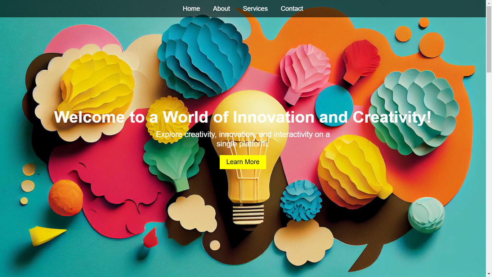

#Responsive_landing_page

### 🔗 **Live preview** of the project is [here](https://gowtham6477.github.io/PRODIGY_WD_01_Responsive_landing_page/).
## Description
This is a responsive landing page created using HTML, CSS, and JavaScript. The page is designed to
be fully responsive and adaptable to different screen sizes and devices.

## 🚀 Features

- **Responsive Design**: Adapts seamlessly to various screen sizes (desktop, tablet, and mobile).
- **Modern Aesthetics**: Clean and professional design layout.
- **Interactive Elements**: Includes buttons, forms, and other user interface components.
- **Cross-Browser Compatibility**: Tested across major web browsers.
- **Customizable**: Easily adaptable to other projects or use cases.

### **Outcome:**
- **HTML5**: Markup language for structuring the web page.
- **CSS3**: Styling and layout using responsive design principles.
- **JavaScript**: Interactive and dynamic functionalities.
